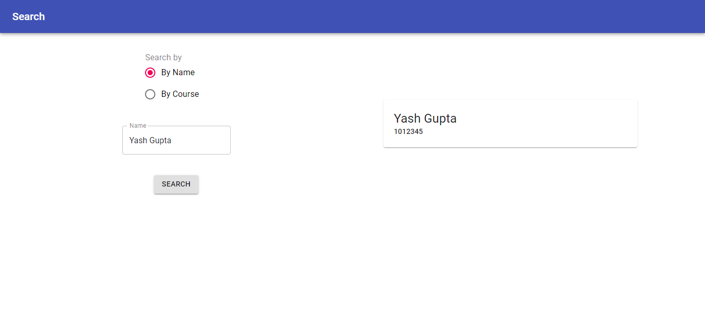
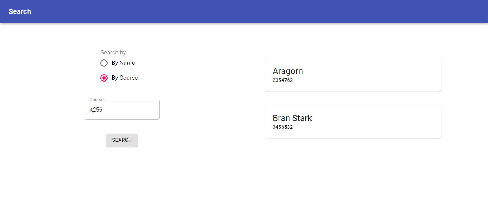
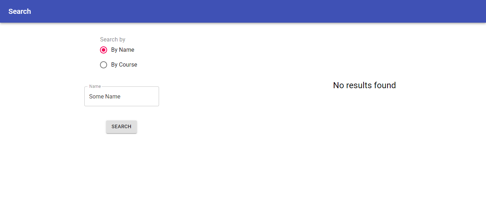

# React Project

 This React app searches for student record in a database, using a Node.js API that uses MySQL to store data in two tables. Some screenshots of the app, using a simple, minimalistic design.

